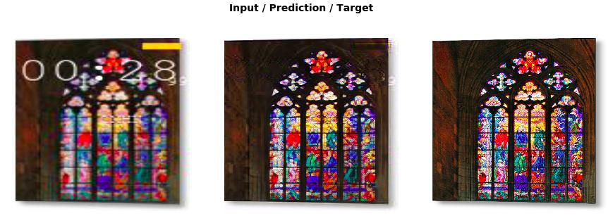

# Superesolution-and-watermark-removal
Using Dynamic unet with Vgg16 batch norm to enhance resolution and remove watermarks
Trained for removing unwanted text on top of wallpaper.
Stay tuned for new model.

U-Net: Convolutional Networks for Biomedical Image Segmentation
https://arxiv.org/abs/1505.04597

